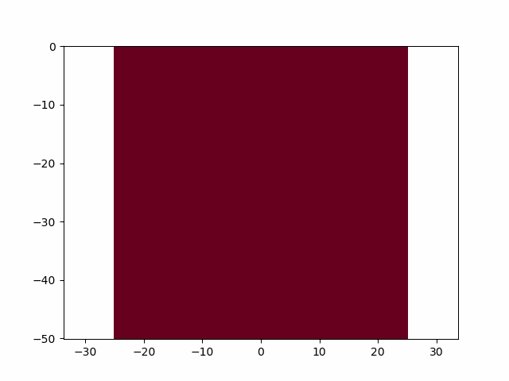

This repository is a complement to the paper *Three-dimensional nonlinear soil–structure interactionfor Rayleigh wave incidence in layered soils* (2022) published in the **Earthquake Engineering & Structural Dynamics**. 

The **TML-DRM method** is implemented in a Python script for generation of SV (shear-wave) and RH (Rayleigh-wave). The provided scripts are

## SV.py
- The script has the functions required to produce a SV wave a in 2D layered media\n
- The script will produce the following animation 

## RH.py
- The script has the functions required to produce a SV wave a in 2D layered media
- The script will produce the following animation 

Author
======

- Kien T. Nguyen (kiennguyen@alumni.caltech.edu)
- Danilo S. Kusanovic (danilo.kusanovic@usm.cl)
- Domniki M. Asimaki  (domniki@caltech.edu)

Citation
========
Please if you use this script or any part of it, cite as follows:

Kien T. Nguyen, Danilo S. Kusanovic, and Domniki Asimaki (2022). Three-dimensional nonlinear soil–structure interactionfor Rayleigh wave incidence in layered soils. *Computers and Geotechnics*. [](https://doi.org/10.1016/j.cma.2009.08.016)

```
@article{KienTML-DRM2022,
title   = {Three-dimensional nonlinear soil–structure interactionfor Rayleigh wave incidence in layered soils},
author  = {Kien T. Nguyen and Kusanovic S. Danilo and Asimaki Domniki},
journal = {Earthquake Engineering & Structural Dynamics},
volume  = {},
number  = {},
pages   = {},
year    = {2022},
issn    = {},
doi     = {},
url     = {}
}
```
